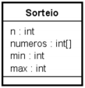

# poo-sorteio
Primeiro projeto da disciplina de Programação Orientada a Objetos

## Descrição do projeto
Implementar a classe Sorteio do diagrama UML, para realizar um sorteio de n
números inteiros distintos.

Cada número do sorteio deve ser gerado aleatoriamente em um intervalo entre min
e max (inclusive) e não pode se repetir durante um sorteio. Os números gerados devem ser
armazenados num array sem duplicatas e serão ordenados crescentemente no momento do
resultado.

### Atributos

- n – quantidade de números a serem gerados sem duplicatas
- min – menor número a ser gerado
- max - maior número a ser gerado
- números – array para guardar os números sem duplicatas

### Métodos
- Sorteio(int n, int min, int max) – método construtor que inicializa o processo de sorteio
- void gerarNumeros() – gera todos os números do sorteio sem duplicatas
- void proximoNumero() – gera apenas um número do sorteio (ainda não gerado
anteriormente)
- boolean terminou() – retorna true se o sorteio terminou (foram gerados todos os n
números sem duplicatas) e falso, do contrário.
- String resultado(String padrao) – retorna uma string com os números gerados até o
momento, ordenados e concatenados com o padrao (”-“, “—“, “/”, “.”, etc).

### Exceções
Os métodos abaixo devem lançar uma exceção (Exception) quando a regra for violada:
- No método constructor: 0<n<100, min>0, max>0 e min<=max
- No método proximoNumero: só pode gerar um número se o sorteio não terminou
- No método resultado: o padrao pode ser qualquer string, mas não pode ser null 
